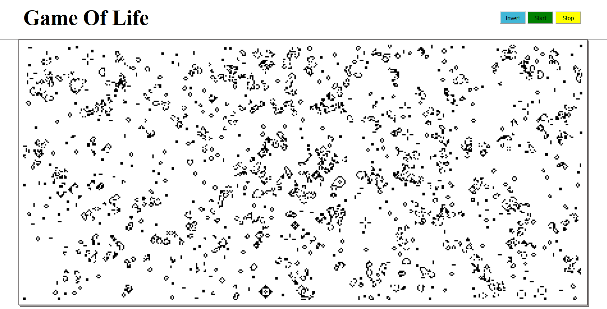

# Conway's Game of Life
The [Game of Life](https://en.wikipedia.org/wiki/Conway%27s_Game_of_Life "Conway's Game of Life"), also known simply as Life, is a cellular automaton devised by the British mathematician John Horton Conway in 1970. It is a zero-player game, meaning that its evolution is determined by its initial state, requiring no further input.

### Rules for evolution
  * Any live cell with two or three live neighbours survives.
  * Any dead cell with three live neighbours becomes a live cell.
  * All other live cells die in the next generation. Similarly, all other dead cells stay dead.

